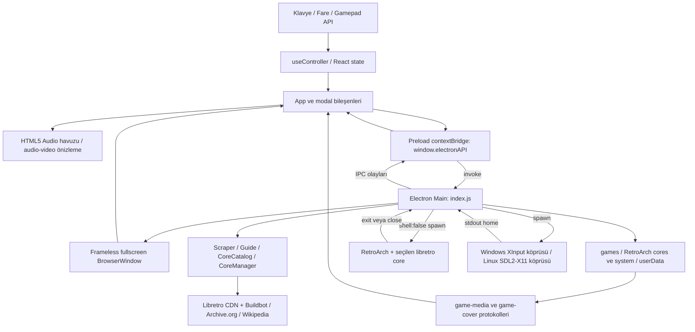
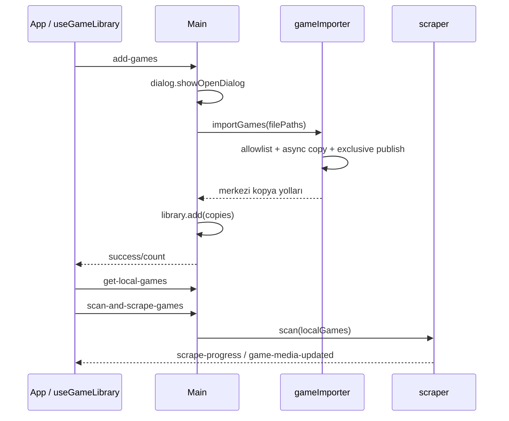
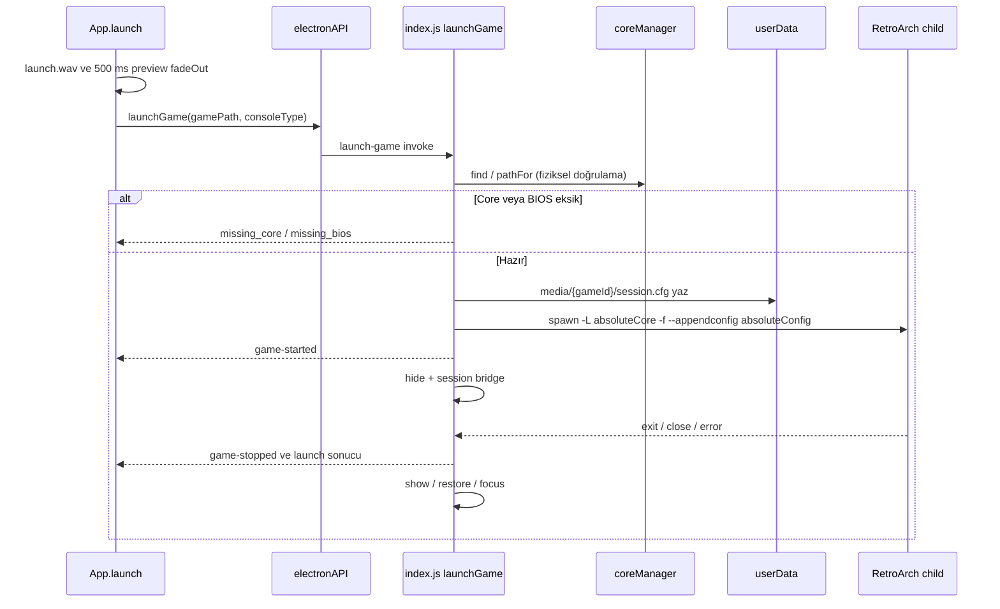

# Zenith OS — Teknik mimari ve katkı rehberi

Bu belge 2 Ekim 2026 tarihindeki kaynak ağacını açıklar. Tasarlanan gelecekteki
modüller ile çalışan kod birbirinden ayrılmıştır. Zenith bir Electron masaüstü
başlatıcısıdır; bağımsız bir çekirdek/işletim sistemi değildir. ROM, BIOS,
RetroArch kurulumu ve indirilen oyun medyası Git kaynak kod dağıtımının parçası değildir.
Üretim installer'ı RetroArch programını ayrı `extraResources` olarak içerir;
BIOS, ROM, çekirdek ikilileri (`cores/**`) ve kişisel çalışma verileri dahil edilmez.
Ana pencere çerçevesiz tam ekran açılır; kapatma ve oyun içi dönüş işlemleri Zenith
menüsü üzerinden yürütülür. Bu görsel konsol modu, işletim sistemi erişimini kilitleyen
bir güvenlik/kiosk politikası değildir.

## 1. Genel sistem mimarisi ve teknoloji yığını



| Katman    | Teknoloji / görev                                                                                                                             |
| --------- | --------------------------------------------------------------------------------------------------------------------------------------------- |
| Ana süreç | Electron 39; Node `fs`, `child_process`, `path`, `crypto`, `zlib`; pencere, IPC, dosya ve emülatör yaşam döngüsü.                             |
| Köprü     | `@electron-toolkit/preload` ve Electron `contextBridge`. Uygulama metotları Promise tabanlıdır.                                               |
| Renderer  | React 19, JavaScript/JSX; merkezi App state, küçük özel hook'lar; Redux/Zustand yok.                                                          |
| Derleme   | electron-vite 5; Vite 7 + React eklentisi; ana süreç, preload ve renderer ayrı çıktılar.                                                      |
| Stil      | Tailwind CSS 4, `@tailwindcss/postcss`; `main.css` içinde konsol stili ve değişkenler.                                                        |
| Paketleme | electron-builder 26; Windows x64 NSIS/portable, Linux x64 AppImage/deb.                                                                       |
| Emülasyon | Ayrı RetroArch süreci; Windows `.dll`, Linux `.so` libretro çekirdeği; uygulamaya gömülü emülasyon yok.                                       |
| Ses       | Vite ile paketlenen WAV → `new Audio()`; müzik/video → DOM `audio`/`video`. Web Audio API, AudioContext veya sentetik oscillator kullanılmaz. |

Sürümlerin tekrarlanabilir kaynağı `package-lock.json`'dır. `package.json` aralıkları
ile kurulu sürüm aynı şey değildir; `npm ci` kullanın. Bu ortamda Node 24.21.0,
Electron 39.8.10, Vite 7.3.6 ve React 19.3.0 ile doğrulandı.

### Güvenlik ve izolasyon sınırları

- `createWindow()` açıkça `contextIsolation: true`, `nodeIntegration: false`
  ayarlar. React doğrudan `fs`, `spawn` veya `require` kullanmaz.
- Preload `sandbox: false` ile çalışır; bu, renderer Node entegrasyonunun açık
  olduğu anlamına gelmez. Chromium renderer sandbox'ı bakımından bu bir sınırlamadır.
- `window.electronAPI` uygulamanın dar amaçlı sözlüğüdür. `window.api = {}` boş
  şablondur. `window.electron` ise toolkit'in genel Electron köprüsünü de sunar;
  bu nedenle yalnızca dar uygulama metotlarının expose edildiği iddia edilmemelidir.
- Preload context isolation kapalıysa doğrudan `window` atayan bir geliştirme
  fallback'i taşır; üretimde izolasyonu kapatmayın.
- `src/renderer/index.html` CSP'si uzak scriptleri engeller, görsel ve sesi
  `self`, `game-cover:`, `game-media:` kaynaklarından alır. Uzak HTML renderer'a
  yerleştirilmez. Dış bağlantılar Main `setWindowOpenHandler` → `shell.openExternal`
  yoluyla açılır; uygulama içerisine yeni web penceresi alınmaz.
- Main oyun yolunu kütüphaneyle doğrular; çekirdek ismini renderer'dan bir komut
  veya URL olarak kullanmaz. Çekirdek seçiminde katalog/yerel kurulum üyeliği,
  dosya adı ve host uzantısı denetlenir. `spawn` shell açmaz.
- `game-media` yalnızca Main tarafından kayıt edilmiş URL/dosya eşleşmelerini
  sunar; renderer'ın keyfi `file://` yolu okuması için genel bir endpoint yoktur.
- Bu kontroller teknik sınırlardır; indirilen içeriğin lisansını veya BIOS'un
  gerçekliğini kanıtlamaz. Mevcut IPC'de ayrıca frame/origin yetkilendirme katmanı
  yoktur; renderer'a uzaktan uygulama yüklenmemesi bu mimarinin önemli varsayımıdır.

### Pencere yaşam döngüsü ve çerçevesiz konsol modu

`src/main/index.js:createWindow`, `BrowserWindow` oluştururken
`fullscreen: true`, `kiosk: true`, `frame: false`, `autoHideMenuBar: true` kullanır.
`show: false` ilk boyama hazır olana kadar pencereyi gizler;
`ready-to-show` olayında `show()` çağrılır. 1440×800 boyutları tam ekran dışındaki
varsayılan pencere ölçüleridir; tam ekran içerik alanını ekran belirler.
Windows başlık çubuğu ve yerel büyüt/küçült/kapat kontrolleri çizilmez.
Geliştirme ve paketli sürüm aynı pencere seçeneklerini kullanır.

`contextIsolation: true`, `nodeIntegration: false`, preload yolu ve mevcut
`sandbox: false` ayarı korunur. Tam ekran için yeni IPC veya renderer yetkisi yoktur.
`Alt+F4`, işletim sistemi görev değiştirme ve sistem tuşları genel olarak engellenmez;
Electron kiosk modu etkin olsa da bu bir Windows güvenlik kilidi değildir. Escape/F10 veya yapılandırılmış
kombinasyon → ana menü → `quit-app` normal çıkış yoludur.

Emülatör başladığında `hide()` tam ekran özelliğini değiştirmez. Oturum menüsünde
`openSessionMenu` show/focus/always-on-top uygular; `resumeSession` tekrar gizler.
Child çıkışındaki idempotent `finish`, always-on-top'ı kaldırıp show/restore/focus
çağırır. Paketli runtime kopyalaması bu pencerenin açılmasını bekletmez.
`tests/runtime-startup.cjs` normal ve kritik kopyalama-hatası senaryolarında gerçek
pencerenin fullscreen durumunu, otomatik gizlenen menüyü ve içerik/dış sınırlarının
aynı olmasını doğrular. `tests/local-games.cjs` artık 1440 px'e bağlı sekiz sütun
varsaymak yerine kullanılabilir genişlikten poster kapasitesini ve dikey gezinmeyi sınar.

### Kaynak açıklamalarını okuma ve güncel tutma

Main servisleri, preload metotları, React bileşenleri, hook'lar ve yerel yardımcılar
üzerindeki İngilizce JSDoc blokları amaç, yan etki ve parametre sözleşmelerini açıklar.
Kritik ref/state ve yapılandırma açıklamaları sahiplik, eşzamanlılık ve neden ayrı
saklandıkları üzerine odaklanır. Effect açıklamaları abonelik/timer temizliğini ve
geç kalan yanıtların nasıl ele alındığını belirtir. JSON sözlüklerine yorum eklenmez;
JSON sözdizimini bozmak yerine i18n sözleşmesi hook ve bu belgede tutulur.

Bir davranış değişikliğinde fonksiyon açıklamasını, ilgili IPC satırını ve regresyon
testini birlikte güncelleyin. JSDoc bir çalışma zamanı doğrulaması değildir;
renderer'dan gelen değerler Main'de ayrıca doğrulanmalıdır. React callback'leri
bulundukları hook/bileşenin ref ve state'ini kapatır; cleanup eklemeden yeni bir
poller, ses oynatıcı veya global event dinleyicisi oluşturmayın.

## 2. Dosya ve klasör hiyerarşisi

Envanter uygulama kaynaklarını, yardımcıları, testleri ve yapılandırmayı kapsar.
`node_modules/`, `out/`, `dist/` üretilen/üçüncü taraf içeriktir; içlerindeki
kopya JavaScript dosyaları bağımsız Zenith modülleri değildir. Yerel `emulators/`
kurulumu da geliştirme bağımlılığıdır, katkı yapılacak kaynak ağacı değildir.

```text
zenith/
├── src/
│   ├── main/index.js
│   │   └── services/ (aşağıdaki servis envanteri)
│   ├── preload/index.js
│   ├── shared/{consoles,hotkeys}.js
│   └── renderer/
│       ├── index.html
│       └── src/{App.jsx,main.jsx,components/,hooks/,locales/,assets/}
├── resources/              uygulama ikonu ve native giriş köprüleri
├── scripts/                dağıtım koruması
├── tests/fixtures/         sentetik test verisi üreticileri
├── .githooks/              yerel pre-commit kontrolü
├── .github/workflows/      CI
├── .vscode/                editör/debug yapılandırması
├── build/                  paket ikonu ve macOS entitlement şablonu
├── games/                  yerel ROM'lar; Git ve dağıtım dışında
├── emulators/retroarch/    yerel runtime; Git dışında, seçili program dosyaları pakette
├── media/                  eski yerel klasör; indirmeler tarafından kullanılmaz
├── node_modules/           npm bağımlılıkları
├── out/                    Vite çıktısı
└── dist/                   builder çıktısı, oluştuğunda
```

### Ana süreç: tüm dosyalar

| Dosya                                | Birincil sorumluluk, süreçler ve dosya işlemleri                                                                                                                                                                                                                                                                                                                                                                                                                                    |
| ------------------------------------ | ----------------------------------------------------------------------------------------------------------------------------------------------------------------------------------------------------------------------------------------------------------------------------------------------------------------------------------------------------------------------------------------------------------------------------------------------------------------------------------- |
| `src/main/index.js`                  | Composition root. `createWindow`, `getLocalGames`, `decorateGame`, `guideGame`, `uploadBios`, `openBiosFolder`, `launchGame`, `openSessionMenu`, `resumeSession`; tüm IPC kayıtları ve iki özel protokol. ROM dizinini oluşturur/okur; ROM ve BIOS silme/kopyalama, tercih JSON'u, session.cfg, saves/states oluşturma. RetroArch child ve native bridge yaşam döngüsünün sahibidir. `launchInProgress`, `activeChild`, `sessionMenuOpen`, `deleting` eşzamanlı işlemleri sınırlar. |
| `src/main/services/platform.js`      | `runtimePaths`, `pathKey`: Windows portable/kurulu/geliştirme ve Linux yolları. Windows karşılaştırmasını küçük harfe normalize eder; Linux case-sensitive kalır. Süreç başlatmaz.                                                                                                                                                                                                                                                                                                  |
| `src/main/services/gameImporter.js`  | `createGameImporter`: Promise kuyruğuyla asenkron merkezi kopyalama; geçici `.import-UUID.part`, exclusive hedef yayınlama, isim çakışmasında numaralandırma. PSP yol ipucunu ISO adına taşır. Kaynak dosyayı silmez. ZIP/7z açmaz, CUE/GDI yan dosyalarını kendiliğinden kopyalamaz.                                                                                                                                                                                               |
| `src/main/services/libraryStore.js`  | `library.json` yükle/kaydet; `add`, `remove`, `list`, `excluded`. Merkezi kopyaları ve eski dış referansları tutar, yolları tekilleştirir. Senkron JSON `.tmp`/rename kullanır. `games.json` medya manifestiyle karıştırılmamalıdır.                                                                                                                                                                                                                                                |
| `src/main/services/scraper.js`       | `cleanGameName`, `gameMediaId`, `createScraper`. Libretro Named_Boxarts/Snaps/Titles kataloglarından eşleşen PNG; yerel kapak önceliği, userData manifesti, güncelleme/progress callback'leri. `scan`, `enrich`, `forget`, `whenMediaIdle`; silinen oyunun geç gelen indirmeyle geri yazılmasını önler.                                                                                                                                                                             |
| `src/main/services/mediaScraper.js`  | Archive.org ses/video arama, metadata eşleştirme ve stream indirme. `theme.mp3`/`preview.mp4`, 15 sn timeout, 5 MiB sınır; ayrı başarısızlık/cooldown, redirect allowlist, imza doğrulaması ve `.part` temizliği. KHInsider/Zophar kullanılmaz.                                                                                                                                                                                                                                     |
| `src/main/services/mediaPaths.js`    | `mediaRoot`, `gameMediaDirectory`: absolute userData zorunlu; oyun ID'si `[a-z0-9-]`, en fazla 151 karakter. Verilen keyfi mediaDirectory'yi hedef kabul etmez.                                                                                                                                                                                                                                                                                                                     |
| `src/main/services/local-media.js`   | `mediaUrl`, `serveMedia`, `revokeMediaDirectory`: SHA-256 anahtarlı runtime URL tablosu; GET/HEAD, byte range/suffix range, MIME ve 416/404 davranışı. Akışla servis eder; tüm videoyu belleğe almaz.                                                                                                                                                                                                                                                                               |
| `src/main/services/guideService.js`  | Wikipedia REST lore ve Archive.org videogamemanuals/BookReader metadata/sayfaları. `getLore`, `getManual`, `getPage`, `getFeatures`, `setFeatures`, `whenIdle`. 10 sn, JSON 2 MiB/sayfa JPEG 8 MiB, en fazla 512 sayfa; local lore/manual cache ve eşzamanlı istek tekilleştirme.                                                                                                                                                                                                   |
| `src/main/services/biosStatus.js`    | `BIOS_RULES`, `biosDirectory`, `biosStatus`, `deleteBios`. PS2, PS1, Dreamcast ad/boyut denetimi; yalnızca ilgili BIOS adaylarını kaldırır, system dizininin tamamını silmez. Süreç/ağ yok.                                                                                                                                                                                                                                                                                         |
| `src/main/services/coreManager.js`   | `CORE_FILES`, `coreFilesFor`, `buildbotBase`, `extractCore`, `createCoreManager`. `find`, `pathFor`, `install`, `installNamed`; resmi x64 Buildbot ZIP'i, CRC ve Windows PE/Linux ELF64 kontrolü; 120 sn/200 MiB sınır. `installedCorePath` fiziksel, okunabilir ve doğru host başlığına sahip dosyayı doğrular; geçerli dosya yeniden indirilmez, bozuk/boş dosya atomik olarak yenilenir. Aynı dosya listesi kurulumları tekilleşir.                                              |
| `src/main/services/coreCatalog.js`   | `createCoreCatalog`, `biosPlatformForCore`: hosta uygun tüm Buildbot core dosyalarını listeler, kurulu core'ları birleştirir, alfabetik ad/arama alias'ları üretir. 10 sn/2 MiB, 1 saat RAM cache, userData disk fallback. `list`, `allowed`, `get`, `select`, `forget`; oyun veya platform bazında çekirdek tercihi. BIOS isteyen bilinen core ailesini seçilen dosya adından da tanır.                                                                                            |
| `src/main/services/sessionBridge.js` | `startSessionBridge`: Windows PowerShell veya Linux Python child process. Sayısal PID ve doğrulanmış hotkey JSON'unu stdin'den geçirir; stdout `home` satırını callback'e dönüştürür. `update`, `resume`, `stop`; parçalı stdout satırlarını tamponlar, stderr loglar. Linux script yolunu `app.asar.unpacked` fiziksel yoluna dönüştürür.                                                                                                                                          |

`retroarchProcess.js`, `libraryScanner.js` ve `windowManager.js` isimli dosyalar
mevcut değildir; bu sorumluluklar bugün `index.js` içindedir. `bgm.js` yerine
`mediaScraper.js`, `guideService.js` dışında ayrı `loreScraper.js` yoktur.

### Preload ve paylaşılan model

| Dosya                    | Sorumluluk                                                                                                                                                                                                                                         |
| ------------------------ | -------------------------------------------------------------------------------------------------------------------------------------------------------------------------------------------------------------------------------------------------- |
| `src/preload/index.js`   | Uygulama invoke metotları ve unsubscribe döndüren event abonelikleri. Tam metot/parametre listesi bölüm 3'tedir. `window.api` boş, `window.electronAPI` gerçek uygulama API'si, `window.electron` toolkit köprüsüdür.                              |
| `src/shared/consoles.js` | Konsol–uzantı tablosu ve iki dosya seçici filtresi. Importer, scanner, library ve renderer aynı tabloyu kullanır. ISO PS2 varsayılanı; PSP adı/yolu tarayıcıda override. SMD→Genesis, V64→N64, A26/A78/LNX→Atari; BIN/ROM/ATX/ZIP/7z `Unassigned`. |
| `src/shared/hotkeys.js`  | Varsayılan `[8,9]`, klavye default `[]` (Esc/F10); tuş adı/Windows sanal kod dönüşümü, farklı iki tuş doğrulaması ve `createGamepadHotkey`. Modalda tüketilen basışın bırakılma eylemini ana ekrana sızdırmaz.                                     |

### Renderer girişleri ve tüm bileşenler

| Dosya                             | Props, state ve görev                                                                                                                                                                                                                                                                                              |
| --------------------------------- | ------------------------------------------------------------------------------------------------------------------------------------------------------------------------------------------------------------------------------------------------------------------------------------------------------------------ |
| `src/renderer/index.html`         | CSP, root DOM ve Vite giriş modülü.                                                                                                                                                                                                                                                                                |
| `src/renderer/src/main.jsx`       | `main.css`, React StrictMode, `I18nProvider`, App mount.                                                                                                                                                                                                                                                           |
| `src/renderer/src/App.jsx`        | Props yok. `currentIndex`, konsol filtresi, arama/draft, OSK, guide, panel, busy/notice/error, launchState, previewEnabled. Kütüphane hook'u, input routing, hero/grid/footer ve ana modal içerikleri burada. `MainLayout`, `GameCard`, `SettingsModal`, `FilterModal`, `GameOptionsModal` ayrı dosyalar değildir. |
| `components/ConsoleModal.jsx`     | `{title,children,onClose,busy,kind}`; native dialog showModal/focus restore, option index ve remembered index ref'leri; 2D filtre veya 1D kontrol listesi, dropdown/hotkey/core-search event yönlendirmesi. `data-controller-focused` mavi çerçeveyi DOM focus kaybolsa da taşır.                                  |
| `components/ConsoleDropdown.jsx`  | `{label,value,options,onChange}`; open/index, dil listesinde A aç/uygula, B kapat, up/down sınırda durur. Dil state'i parent'tadır.                                                                                                                                                                                |
| `components/SystemSettings.jsx`   | `{preferences,togglePreference,saveHotkeys,playSound,systemPage,onOpenSystems,onDeleteBios,onBrowseCores}`; systems/busy/message. Dil, iki ses switch'i, hotkey editor; alt sayfada yalnızca kütüphanede görülen konsollar, core/BIOS durumları, indirme/Gözat/silme/yükleme.                                      |
| `components/HotkeySetting.jsx`    | `{hotkeys,onSave}`; editing `{device,keys}`, error, saving ref. İki aşamalı dinleme, aktif cihaz rozetleri, B/Esc iptal, Promise başarılıysa kalıcı tercih.                                                                                                                                                        |
| `components/CoreBrowser.jsx`      | `{onSelect,busy}`; catalog/query/filter/keyboard. `listCores()`; 150 ms debounced canlı ad+dosya adı araması. X veya arama alanında A ile OSK; her onChange listede uygulanır. Seçim parent'ın install/select/launch akışına gider.                                                                                |
| `components/OnScreenKeyboard.jsx` | `{value,onChange,onClose}` kontrollü metin; TR/EN layout, symbols, 2D position, caret/selection, editing. iOS üç harf satırı, Backspace ve alt fonksiyon satırı. String'in seçilen bölümünü değiştirir; B/Menu/Done kapatır. Ayrı VirtualKeyboard dosyası yok.                                                     |
| `components/GuideDrawer.jsx`      | `{game,onClose}`; lore/manual/features/loading, tab/page/pageResult, page-cache ve scroll ref. İki sekme, LB/RB sınırlandırılmış, right-stick/dikey D-pad scroll, yatay sayfa çevirme; remote HTML göstermez.                                                                                                      |
| `components/InputHint.jsx`        | `InputHint({keyboard,gamepad,children})`, `KeyBadge({keyboard,gamepad})`; InputContext'e göre keyboard veya renkli Xbox rozeti. Yerel state yok.                                                                                                                                                                   |
| `components/Versions.jsx`         | Şablon kalıntısı; props yok, toolkit'ten versions state'i. Aktif dashboard tarafından import edilmez.                                                                                                                                                                                                              |

### Renderer hook'ları, state ve varlıklar

| Dosya                                                    | API ve davranış                                                                                                                                                                                                                                                                                                                                        |
| -------------------------------------------------------- | ------------------------------------------------------------------------------------------------------------------------------------------------------------------------------------------------------------------------------------------------------------------------------------------------------------------------------------------------------ |
| `hooks/useController.js`                                 | `useController(onFrame)` → `{mode,modeRef,controller}`. Tek `requestAnimationFrame` döngüsü, sabit 60 Hz garanti edilmez. İlk bağlı kol, axis deadzone 0.25, yön eşiği 0.5; ilk repeat 350 ms, sonra 150 ms. `hit`, `released`, `buttons`, `axes`, `move`, `now`, `inputMode`. Pil bilgisi varsa normalize eder; standart API'de pil zorunlu değildir. |
| `hooks/inputContext.js`                                  | Rozetler ve giriş modunun React context tanımı.                                                                                                                                                                                                                                                                                                        |
| `hooks/useGridColumns.js`                                | Grid ref → ResizeObserver ve computed grid tracks sayısı. Sütun sayısı navigasyon/adaptive row state için tek ölçüdür; sabit 8 yok.                                                                                                                                                                                                                    |
| `hooks/useGameLibrary.js`                                | games/loading/error/scanning/progress/warning, `refresh(force)`, `removeFromState`. Önce yerel oyunları gösterir, sonra scrape eder. Geç gelen music/video event'lerini hızlı/yavaş artwork güncellemelerinin üzerine korur; mount/unmount abonelik temizliği.                                                                                         |
| `hooks/useMediaPreview.js`                               | `(game,enabled,sound)` → videoRef/audioRef/cinematic/stop/fadeOut/restart. 800 ms bekleme, 400 ms fade-in, maks 0.3 volume; karttan ayrılınca audio 150 ms fade-out, video reset. Launch fade 500 ms. Blur/visibility/unmount timer, rAF ve medya cleanup.                                                                                             |
| `hooks/useSoundEffects.js`                               | `(enabled)` → `play`; ayrıca `emitSound(name)`. WAV import'ları; navigate dört Audio voice, 30 ms tekrar sınırlaması, boş voice yoksa yeni ses atlanır. Toggle/launch birer voice; menü kapalıysa navigate/toggle durur, launch ayrı tutulur.                                                                                                          |
| `hooks/usePreferences.js`                                | preferences/togglePreference/saveHotkeys. Menü sesi ve önizleme sesi boolean; hotkeys normalize. localStorage `zenith-preferences`; native hotkey dosyasıyla hydrate/senkronizasyon.                                                                                                                                                                   |
| `hooks/useClock.js`                                      | Sistem HH:mm, h23; 1000 ms interval cleanup; locale formatı tr-TR.                                                                                                                                                                                                                                                                                     |
| `hooks/i18n.jsx`                                         | `I18nProvider({children})`, `useI18n()` → language/setLanguage/t. Default en, fallback en/key, HTML lang güncelleme ve `zenith-language` localStorage.                                                                                                                                                                                                 |
| `hooks/useBiosManager.js`                                | Eski tekrar kullanılabilir hook `(onClose)`; platform/dialogRef/busy/error/notice ve show/close/upload/openFolder. Aktif App BIOS UI'si bunu kullanmaz, App.run üzerinden çalışır.                                                                                                                                                                     |
| `locales/en.json`, `locales/tr.json`                     | Arayüz sözlükleri; teknik/native servis hatalarının tamamı henüz çevrilmiş değildir.                                                                                                                                                                                                                                                                   |
| `assets/main.css`                                        | Tailwind import, Xbox rozetleri, vignette, 144×216 poster, gap16, auto-fill grid, adaptive height, ince scrollbar, modal/OSK/drawer stili.                                                                                                                                                                                                             |
| `assets/base.css`                                        | Electron/Vite şablon renk/font temel stili; güncel main.jsx bunu import etmez.                                                                                                                                                                                                                                                                         |
| `assets/electron.svg`, `assets/wavy-lines.svg`           | Kullanılmayan şablon varlıkları; telif/lisans envanteri açısından yine kaynak varlığı sayılır.                                                                                                                                                                                                                                                         |
| `assets/sounds/navigate.wav`, `toggle.wav`, `launch.wav` | Kullanıcı tarafından sağlanan üç UI sesi. Vite bundle asset'leri; Git'te dar istisna. navigate ve toggle aynı byte içeriğindeyse Vite tek output dosyasını paylaşabilir.                                                                                                                                                                               |

Renderer'da ayrı `services/`, `store/` veya `context/` klasörü yoktur. Context'ler
hooks altında; iş verisi React state ve Main JSON dosyalarında bulunur. Paketlenen
özel font yoktur; CSS sistem fontlarını kullanır.

### Native yardımcılar, kök yapılandırma ve testlerin tam envanteri

| Dosya                                                                                 | Görev                                                                                                                                                                                                                 |
| ------------------------------------------------------------------------------------- | --------------------------------------------------------------------------------------------------------------------------------------------------------------------------------------------------------------------- |
| `resources/gamepad-bridge.ps1`                                                        | Windows XInput/GetAsyncKeyState: 20 ms polling, emulator foreground + 500 ms grace, validated Zenith HWND/PID activation. stdin: JSON pad/keys/zenithWindow/zenithPid, focus-zenith/resume/stop; stdout: home.        |
| `resources/gamepad-bridge.py`                                                         | Python stdlib ctypes → sistem SDL2/X11; 30 ms polling. Linux gamepad background hint, X11 keymap, /proc/PID yaşam kontrolü; Python/SDL2 yoksa yardımcı çalışmayabilir, Wayland eşdeğeri yok.                          |
| `resources/icon.png`                                                                  | Electron pencere/Linux ikonu.                                                                                                                                                                                         |
| `build/icon.png`, `build/icon.ico`, `build/icon.icns`, `build/entitlements.mac.plist` | Builder kaynakları ve şablon macOS entitlement. Bunlar runtime oyun medyası değildir; dağıtım hakları yine doğrulanmalıdır.                                                                                           |
| `scripts/check-distribution.mjs`                                                      | Git indeksini inceler; ignored/runtime yolları ve şüpheli binary magic/2 MiB'den büyük staged blob'ları reddeder. Uygulama ikonları/şablon SVG/üç WAV dar allowlist. Commit geçmişini veya medya lisansını incelemez. |
| `.githooks/pre-commit`                                                                | Dağıtım kontrolünü commit öncesinde çalıştırır; clone sonrası ayrıca etkinleştirilir.                                                                                                                                 |
| `.github/workflows/ci.yml`                                                            | Push/PR verify: windows-latest + Node 22; npm ci, dağıtım kontrolü, lint, Node testleri, Vite build. Installer veya Electron UI testi çalıştırmaz; yayın/deploy yok.                                                  |
| `package.json`, `package-lock.json`                                                   | Komutlar, bağımlılıklar ve kilitli çözümleme.                                                                                                                                                                         |
| `electron.vite.config.mjs`                                                            | Main/preload/renderer build; `@renderer` alias'ı, React plugin. `@/` alias'ı tanımlı değildir.                                                                                                                        |
| `electron-builder.yml`                                                                | ASAR uygulama allowlist’i; extraResources ile RetroArch; kişisel runtime verilerinin dışlanması; beforePack doğrulaması; platform hedefleri. Publish URL/author şablondur, release öncesi düzenlenmelidir.            |
| `eslint.config.mjs`, `.prettierrc.yaml`, `.prettierignore`, `.editorconfig`           | Lint/format/editor sözleşmesi.                                                                                                                                                                                        |
| `postcss.config.js`, `tailwind.config.js`                                             | PostCSS/Tailwind yapılandırması; Tailwind4 giriş noktası main.css'tir.                                                                                                                                                |
| `.gitignore`                                                                          | Dinamik dosyalar, BIOS/core/ROM/disk/medya, tüm emulators ağacı; büyük-küçük harf varyantlarını da kapsar.                                                                                                            |
| `.vscode/extensions.json`, `.vscode/settings.json`, `.vscode/launch.json`             | Önerilen eklentiler/ayarlar; main ve renderer için debug/9222 compound.                                                                                                                                               |
| `README.md`, `ARCHITECTURE.md`                                                        | Kullanıcı/kurulum rehberi ve bu geliştirici sözleşmesi.                                                                                                                                                               |
| `tests/fixtures/core-archive.cjs`                                                     | Sentetik ZIP + PE/ELF fixture üretir; gerçek çekirdek içermez.                                                                                                                                                        |
| `tests/console-services.test.mjs`                                                     | ZIP/core fallback/kurulum, library persistence, BIOS teşhis/silme.                                                                                                                                                    |
| `tests/core-catalog.test.mjs`                                                         | Katalog origin/path filtreleme, offline cache, seçim/silme, Atari eşlemeleri ve named kurulum.                                                                                                                        |
| `tests/guide.test.mjs`                                                                | Mock Wikipedia/Archive eşleşme, timeout, sayfa/cache/feature davranışı.                                                                                                                                               |
| `tests/import-hotkeys.test.mjs`                                                       | Merkezi kopya, çakışma, genişletilmiş formatlar, native tuş doğrulama ve chord sızıntısı.                                                                                                                             |
| `tests/media-paths.test.mjs`                                                          | userData confinement, sahte hedef reddi, Git ignore büyük/küçük harf kuralları.                                                                                                                                       |
| `tests/platform.test.mjs`                                                             | Linux/Windows path, ELF/PE ve BIOS case davranışı.                                                                                                                                                                    |
| `tests/scraper.test.mjs`                                                              | Libretro üç görsel, Archive ses/video, akış limitleri, timeout, cache/yarışlar ve range.                                                                                                                              |
| `tests/local-games.cjs`                                                               | Gizli Electron: klasör/tarama/kapak, konsol filtreleri ve gezinme, boş/hata durumları.                                                                                                                                |
| `tests/launcher.cjs`                                                                  | Electron launch/spawn argümanları, PSP/PS2 fallback, süreç hatası/restore.                                                                                                                                            |
| `tests/bios.cjs`                                                                      | Electron IPC/BIOS modalı, upload/folder/delete ve launch engeli.                                                                                                                                                      |
| `tests/media.cjs`                                                                     | IPC medya güncellemesi, gerçek DOM audio/video mock, debounce/fade/range/cleanup.                                                                                                                                     |
| `tests/guide.cjs`                                                                     | Drawer sekme, gamepad scroll, manual sayfaları ve ağ boş durumları.                                                                                                                                                   |
| `tests/controller.cjs`                                                                | Pil/saat/mod, D-pad/analog, options focus ve OSK arama/focus trap.                                                                                                                                                    |
| `tests/console-os.cjs`                                                                | Dil/audio/sistemler, merkezi import/delete, launch/core/session; --screenshot ile 1920/1280/1024 responsive layout.                                                                                                   |
| `tests/hotkeys.cjs`                                                                   | Remap, iptal/persistence, native bridge mesajları, Quick Menu config, app quit double'ları.                                                                                                                           |
| `tests/core-browser.cjs`                                                              | Atari missing-core, Gözat listesi, Done beklemeden OSK filtreleme, D-pad ile seçim, kurulum/launch ve kalıcı oyun tercihi.                                                                                            |

Ek dağıtım regresyonu: `tests/distribution.test.mjs`, ayrı geçici Git deposunda
zorla eklenen ROM uzantıları ve yeniden adlandırılmış EXE imzasının commit guard
tarafından reddedildiğini doğrular.

### Envantere dahil ek doğrulama dosyaları

| Dosya                                                     | Doğruladığı sözleşme                                                                                               |
| --------------------------------------------------------- | ------------------------------------------------------------------------------------------------------------------ |
| `tests/core-verification.test.mjs`                        | Fiziksel core denetimi, diskten silinince Missing, CRC/başlık/yazma hataları ve Windows Zone.Identifier temizliği. |
| `tests/core-download.cjs`                                 | Paketli runtime hedefi, gerçek Main/Preload/UI, hata bildirimi ve indirme hedefinin mutlak -L yoluyla eşitliği.    |
| `tests/bundled-runtime.test.mjs`                          | Artımlı kopyalama, kilitli opsiyonel CFG, kritik dosya hatası ve yarım dosya onarımı.                              |
| `tests/runtime-startup.cjs`                               | Fullscreen/frameless pencere açılışı, kopyalama beklerken çalışan IPC ve kritik hatada açık kalan pencere.         |
| `tests/emulator-bootstrap.test.mjs`                       | Resmi kararlı sürüm seçimi, sentetik 7z çıkarma, yol/link sınırı ve paket önkontrolü.                              |
| `scripts/nsis-process.cjs`, `tests/nsis-process.test.mjs` | Sınırlı Windows spawn adaptörü, ortam koruması, tekrar politikası ve NSIS sihirbaz ayarları.                       |

`scripts/setup-emulators.mjs`, `scripts/validate-emulators.cjs` ve
`src/main/services/bundledRuntime.js` ayrıntıları bölüm 7'dedir. Bu dosyalar aynı
işlemi yapmaz: geliştirici indirir, builder yerel runtime'ı doğrular, son kullanıcı
uygulaması paketlenmiş programı yazılabilir profile kopyalar.

## 3. IPC sözlüğü

Tüm uygulama istekleri `src/main/index.js` içinde `ipcMain.handle`, preload'da
`ipcRenderer.invoke` ile tanımlıdır. Tablodaki metotların kökü **window.electronAPI**.
`Result` genel olarak `{success:boolean,error?:string,canceled?:boolean}`.
Her invoke bir Promise döndürür; tabloda Promise'ın çözümlenen değeri yazılıdır.

| Kanal                   | Preload metodu / payload                                      | Dönen değer                                                  | İşlem / hata davranışı                                                                                                                                                      |
| ----------------------- | ------------------------------------------------------------- | ------------------------------------------------------------ | --------------------------------------------------------------------------------------------------------------------------------------------------------------------------- |
| `get-local-games`       | `getLocalGames()`                                             | `Game[]`                                                     | Dizini oluşturur/tarar, library ile birleştirir, deleting oyunları çıkarır. FS hatası Promise reject; hook yakalar.                                                         |
| `add-games`             | `addGames()`                                                  | Result + `count`                                             | Native dosya seçimi, central async copy, library.add; cancel ayrı, FS hatası Result.error.                                                                                  |
| `delete-game`           | `deleteGame(gameId)`                                          | Result                                                       | Kütüphane ID doğrulama, launch kilidi, ROM/cache/kayıt temizliği. Renderer silinecek path gönderemez.                                                                       |
| `scan-and-scrape-games` | `scanAndScrapeGames({force?:boolean}={})`                     | `{games,warning}`                                            | Ortak scan Promise; progress/media olayları. Ağ opsiyoneldir; okunabilir yerel kütüphane korunur.                                                                           |
| `launch-game`           | `launchGame(gamePath,consoleType)` → `{gamePath,consoleType}` | Result; missing_core/missing_bios + `platform`, BIOS details | Oyun üyeliği, exe/core/BIOS, spawn. Başarılı invoke **süreç kapanana kadar** pending kalır; başlangıç ayrı event'tir.                                                       |
| `install-core`          | `installCore(platform)`                                       | Result + `core`                                              | Varsayılan core/fallback kurulumu. Unsupported platform Result.error; browser kullanılabilir.                                                                               |
| `list-cores`            | `listCores()`                                                 | `{success,cores:[{fileName,name,installed}],offline,error?}` | Resmi host kataloğu + local kurulum, alfabetik; ağ kesilince cache/local sonuç.                                                                                             |
| `select-core`           | `selectCore({gameId?,platform?,core})`                        | Result + `core`                                              | Gerçek oyun ID veya bilinen platform; Unassigned için oyun ID şart. Katalogda/yerelde olmayan ad reddedilir. Kurulumdan sonra tercih saklanır; IPC doğrudan oyun başlatmaz. |
| `get-system-status`     | `getSystemStatus()`                                           | `[{platform,core,corePath,coreDirectory,bios}]`              | Kütüphanedeki platformlar, platform tercihi veya default kurulu core, BIOS durumu. Oyun bazlı override her sistem satırında gösterilmez.                                    |
| `upload-bios`           | `uploadBios(platform)`                                        | Result + `fileName,status`                                   | Native bin/rom seçimi, doğru hedefe exclusive copy; aynı adlı dosya üzerine yazılmaz, canceled desteklenir.                                                                 |
| `delete-bios`           | `deleteBios(platform)`                                        | Result + `status`                                            | Aktif oyun varsa engel; yalnız bu platformun aday BIOS dosyaları.                                                                                                           |
| `open-bios-folder`      | `openBiosFolder(platform)`                                    | Result                                                       | mkdir + shell.openPath; shell hata metni Result.error.                                                                                                                      |
| `get-runtime-info`      | `getRuntimeInfo()`                                            | `{platform,retroarchDir,gamesDirectory}`                     | Platforma göre çözümlenmiş gerçek yollar.                                                                                                                                   |
| `show-session-menu`     | `showSessionMenu()`                                           | `{success:!!activeChild}`                                    | Native pencereyi öne alır ve session-menu yayar; zaten açıksa yeniden açmaz.                                                                                                |
| `resume-session`        | `resumeSession()`                                             | Result                                                       | Aktif child varsa always-on-top kapat, hide, bridge resume.                                                                                                                 |
| `stop-session`          | `stopSession()`                                               | `{success:true}`                                             | Varsa child.kill; exit callback pencere/state temizliğini yürütür.                                                                                                          |
| `quit-app`              | `quitApp()`                                                   | `{success:true}`                                             | Varsa child.kill, app.quit. Uygulama kapandığı için renderer dönüşü her zaman göremeyebilir.                                                                                |
| `get-hotkeys`           | `getHotkeys()`                                                | `{gamepad:number[2],keyboard:string[]}`                      | Diskten başlangıçta yüklenen normalize runtime tercihi.                                                                                                                     |
| `save-hotkeys`          | `saveHotkeys(hotkeys)`                                        | Result + `hotkeys`                                           | userData JSON `.tmp`/rename; çalışan bridge'e update. Hata Result.error.                                                                                                    |
| `get-guide-features`    | `getGuideFeatures()`                                          | `{manualsEnabled,loreEnabled}`                               | Servis flags; setFeatures servis API'si var, renderer'a ayar yazma IPC'si henüz yok.                                                                                        |
| `get-game-lore`         | `getGameLore(gameId)`                                         | `{summary,year,developer,sourceTitle,sourceUrl}` veya null   | Kütüphaneden resolve; cache/Wikipedia. Eşleşme/ağ/parse hatasında null.                                                                                                     |
| `get-game-manual`       | `getGameManual(gameId)`                                       | `{title,pageCount,sourceUrl}` veya null                      | Cache/Archive metadata; tam internal leaf listesi renderer'a gönderilmez.                                                                                                   |
| `get-manual-page`       | `getManualPage(gameId,index)` → `{gameId,index}`              | URL string veya null                                         | İndeks sınırı, JPEG cache/download, game-media URL. Hata null.                                                                                                              |

`import-game`, `check-bios`, `download-core` isimli alternatif kanallar yoktur.
Bunların karşılıkları sırasıyla add-games, get-system-status/launch-game ve
install-core/select-core'dur. Uygulamada `ipcMain.on` ile ayrı request kanalı yoktur.

### Toolkit köprüsünün mevcut ek yüzeyi

Uygulama API'sine ek olarak window.electron şu toolkit üyelerini expose eder:
`ipcRenderer.send(channel,...args)`, `sendSync(channel,...args)`,
`sendToHost(channel,...args)`, `postMessage(channel,message,transfer)`,
`invoke(channel,...args)`, `on(channel,listener)`, `once(channel,listener)`,
`removeListener(channel,listener)`, `removeAllListeners(channel)` ve
`sendTo(webContentsId,channel,...args)` (Electron >=28'de hata fırlatır).
`webFrame.insertCSS(css)`, `setZoomFactor(factor)`, `setZoomLevel(level)`;
`webUtils.getPathForFile(file)`; `process.platform`, `process.versions`,
`process.env` getter'ları da mevcuttur. Bunlar yeni Main handler kayıtları değildir;
özellikle env ve genel IPC yüzeyi ileride köprüyü daraltırken gözden geçirilmelidir.

### Main → Renderer olayları

| Kanal                | Preload aboneliği              | Payload / kullanım                                                                |
| -------------------- | ------------------------------ | --------------------------------------------------------------------------------- |
| `game-started`       | `onGameStarted(callback)`      | Payload yok; launchState running olur.                                            |
| `game-stopped`       | `onGameStopped(callback)`      | Payload yok; launch/session state sıfırlanır; hata diyaloğunda da gönderilebilir. |
| `session-menu`       | `onSessionMenu(callback)`      | boolean; oyun içi modal aç/kapat.                                                 |
| `scrape-progress`    | `onScrapeProgress(callback)`   | `{completed,total,game,warning?}`; kart ve ilerleme güncellemesi.                 |
| `game-media-updated` | `onGameMediaUpdated(callback)` | Güncel Game; music/video download tamamlanınca canlı güncelleme.                  |

Her abonelik **unsubscribe fonksiyonu** döndürür. useEffect cleanup'ta çağırın;
callback'e Electron event nesnesi expose edilmez.

### IPC olmayan iç olaylar ve protokoller

`controller-input` en üstteki açık dialog'a dispatch edilir. ConsoleModal bunu
`controller-dropdown`, `controller-hotkey`, `controller-core-search` alt olaylarına
yönlendirebilir. `zenith-sound` bir DOM CustomEvent'tir. Native helper stdin
JSON `{pad,keys}` ile `resume`/`stop` satırları alır, stdout `home` üretir.
`game-cover://local/...` aynı dizindeki kullanıcı kapağını; `game-media://local/...`
izin tablosuna alınmış cache dosyasını sunar. Bunlar invoke kanalı değildir.

## 4. Veri yerleşimi ve kritik yaşam döngüleri

### Veri sözleşmesi ve kalıcılık

Game temel alanları: `id,title,fileName,path,system,systemShort,cover,backdrop`.
Enrichment: `gameId,region,year,developer,genre,media,mediaDirectory`; renderer
URL'leri `coverUrl,backdropUrl,titleScreenUrl,musicUrl,videoUrl`. ID, platform + temiz ad slug'ı +
SHA-256'nın 12 hex karakterinden oluşur; eski import kayıtlarında importKey de hash'e girer.
Yıl/geliştirici/tür scraper'da null kalabilir; Wikipedia lore ayrı önbellektir,
her metadata alanının otomatik dolduğu varsayılmamalıdır.

| Yer                                                           | İçerik                                                                                                                                                                |
| ------------------------------------------------------------- | --------------------------------------------------------------------------------------------------------------------------------------------------------------------- |
| Windows geliştirme kökü                                       | `games/`, `emulators/retroarch/{retroarch.exe,cores/,system/}`.                                                                                                       |
| Windows packaged                                              | Oyun kökü portable env veya executable dizinidir. RetroArch ilk açılışta resources'tan userData/emulators/retroarch altına hazırlanır; cores/BIOS burada yazılabilir. |
| Linux                                                         | games daima userData/games; development emülatörü proje kökünde, packaged emülatör userData/emulators/retroarch altında.                                              |
| userData/library.json                                         | Imported paths ve excluded paths.                                                                                                                                     |
| userData/games.json                                           | Scraper metadata/media manifesti; ROM dosyası burada değildir.                                                                                                        |
| userData/zenith-preferences.json                              | Native hotkeys; diğer renderer tercihleri localStorage'dadır.                                                                                                         |
| userData/core-catalog-win32.json veya core-catalog-linux.json | Çekirdek dosya adı cache'i.                                                                                                                                           |
| userData/core-selections.json                                 | `game:<gameId>` veya `platform:<system>` → core dosya adı.                                                                                                            |
| userData/media/{gameId}/                                      | boxart.png, snap.png, title.png, theme.mp3, preview.mp4, lore.json, manual metadata/pages, session.cfg, saves/, states/.                                              |
| localStorage                                                  | zenith-preferences (ses/hotkeys), zenith-language, zenith-keyboard.                                                                                                   |

İndirilen oyun medyası proje köküne yazılmaz. Eski userData/media/music ve videos
yolları geriye uyumlu okunabilir; proje kökündeki media klasörü download hedefi değildir.

### 4.1 Oyun ekleme



`App.addGames → run → electronAPI.addGames → importGames → library.add`.
Başarıdan sonra `refresh(false)` ilk taramayı ve artwork scraping'i başlatır.
Kopya sırasında UI process bloklanmaz. Kaynak aynı merkezi klasördeyse yeniden
kopyalanmaz. Harici orijinal silinse de merkezi kopya kalır. Çok dosyalı CUE/GDI
oyunlarının yan dosyaları için otomatik paket import henüz yoktur; importer yalnız
seçilen dosyaları kopyalar. Arcade romset isim çakışmasında numaralandırma
uyumluluğu bozabilir; böyle setleri isimlerini koruyarak yönetin.

### 4.2 Başlatma, askıya alma ve çıkış

1. `App.launch` launchBusyRef'i kilitler; `playSound('launch')` ve
   `fadeOut()` önizlemeyi 500 ms kısar. UI starting animasyonuna geçer.
2. `launchGame` Main'de exe çalıştırılabilirliğini, kayıtlı yol/platform üyeliğini,
   oyun/platform core override'ını veya default core'u ve BIOS'u denetler.
3. userData oyun dizininde saves/states ve session.cfg yazılır. Overrides:
   `pause_nonactive=true`, `config_save_on_exit=false`,
   `input_menu_toggle_gamepad_combo="0"`, `input_menu_toggle_btn="nul"`,
   `input_menu_toggle="nul"`, `input_exit_emulator="nul"`,
   `input_quit_gamepad_combo="0"`, system/save/state dizinleri.
4. `spawn(executable,['-L',corePath,gamePath,'-f','--appendconfig',config],
{cwd:retroarchDir,shell:false,detached:true,windowsHide:true,stdio:[...]})`.
   Exe adı arguments içine yeniden konulmaz; stdout/stderr terminale yazılır.
5. child `spawn` → game-started → window.hide → native bridge ve Esc/F10
   globalShortcut kayıtları. renderer gizliyken gamepad polling'e güvenilmez.
6. View+Menu veya atanmış çift tuş/native Guide → `openSessionMenu` → show/focus,
   always-on-top, session-menu:true. RetroArch focus kaybıyla duraklar;
   process suspend/signal sistemi uygulanmaz.
7. Return to game → resumeSession/hide/bridge resume. Aynı bırakılmamış Esc'nin
   menüyü anında tekrar açmaması için bridge release bekler.
8. Stop → child.kill. `exit` veya `close`, idempotent finish ile bridge stop,
   shortcuts unregister, game-stopped, show/restore/focus ve invoke resolve.
   Quit to desktop → child.kill + app.quit. Launch hatasında state finally ile açılır.

Windows native köprü XInput'a bağlıdır; Guide tuşunu Game Bar alabilir. Linux
Python3/SDL2 ve klavye için X11 gerektirir. SteamOS/Wayland/globalShortcut erişimi
gerçek cihazda ayrıca doğrulanmalıdır. `pause_nonactive` gerçek oyun içi save değildir.

### 4.3 Çekirdek seçimi ve BIOS

Varsayılan core tablosu: PS2 PCSX2→LRPS2; PS1 DuckStation→Beetle PSX HW→SwanStation;
PSP PPSSPP; NDS melonDS; N64 Mupen64Plus Next; GBA mGBA; GBC Gambatte; SNES Snes9x;
NES Mesen; Genesis Genesis Plus GX; GameCube/Wii Dolphin; 3DS Citra; Dreamcast Flycast;
Atari 2600 Stella; 7800 ProSystem; Lynx Beetle Lynx. Linux aynı dosya stem'ini `.so` kullanır.

```text
launchGame
  core yok → {missing_core, platform}
    App core modal
      İndir → install-core(platform) → coreManager.install → launch tekrar
      Gözat → CoreBrowser → list-cores
        arama input / OSK onChange → 150 ms filtre → D-pad → A
        select-core({gameId,core}) → katalog doğrulama → installNamed
        seçim diske yaz → App.launch(game)
  core var → biosPlatformForCore + biosStatus
    BIOS eksik → {missing_bios,...} → upload-bios → status.ready
      Oyunu Başlat → launch tekrar
    hazır → spawn
```

Çekirdek indirme ve başlatma, `runtimePaths().retroarchDir/cores` altındaki aynı mutlak yolu kullanır. Paketli sürümde bu yol `userData/emulators/retroarch/cores` olur; resources dizinine yazılmaz. Kurulum, runtime hazırlığının bitmesini bekler. ZIP içinden yalnız beklenen DLL/SO çıkarılır, benzersiz `.part` dosyasına yazılır ve rename ile yayımlanır. Hedef dosya tekrar okunarak indirilen byte'larla karşılaştırılmadan başarı dönmez. Ağ/izin/çıkarma/doğrulama hataları işlem aşaması, kaynak URL ve hedef yoluyla `Result.error` olarak renderer'a iletilir. Sistem durumu fiziksel dosyadan hesaplanır, panel açıkken iki saniyede bir ve pencere odaklandığında yenilenir. `-L` öncesinde aynı dosya yeniden kontrol edilir. Başlık doğrulaması çekirdeğin bütün bağımlılıklarının veya ROM uyumluluğunun garantisi değildir.

`node --test tests/core-verification.test.mjs` ağ/izin/bozuk dosya/doğrulama regresyonlarını; `npm run test:core-download` Windows paketli modunda gerçek Main/IPC/renderer, sahte ZIP/ağ/emülatör ile N64 indirme, hata bildirimi, dosya silinince Missing ve mutlak `-L` eşleşmesini sınar.

Settings'ten Gözat platform tercihi kaydeder; oyun modalından seçim sadece o oyuna
uygulanır. Unassigned platformunun tamamına tek core atanmaz. Katalogdaki bütün
çekirdekler her ROM'la uyumlu değildir; liste uyumluluk garantisi değildir.
Kurulu yerel core'lar da listelenir; yeni indirmeler yalnız resmi Buildbot'tandır.
Yerel dosyayı içe alan ayrı native DLL picker yoktur; kullanıcı cores/ içine
koyduğu uygun host çekirdeğini Gözat listesinden seçebilir.

Yeni çekirdekler Node.js Buffer → benzersiz geçici dosya → atomik rename yoluyla
kurulur. Windows'ta yalnız doğrulanmış yeni indirmenin geçici dosyasına ait
`:Zone.Identifier` akışı rename öncesi silinir; ENOENT normaldir, diğer hatalar
`Windows metadata cleanup` aşamasıyla renderer'a döner. Linux bu akışa dokunmaz;
mevcut manuel binary'lere toplu unblock uygulanmaz. Paketler core içermediği için
bu kontrol electron-builder aşamasında değil uygulamanın core installer'ında çalışır.

`launchGame` her oyunun `session.cfg` dosyasına `video_vsync = "true"`,
`video_refresh_rate = "60.0"`, `audio_sync = "true"`, `audio_rate_control = "true"`,
`fastforward_ratio = "1.0"`, `video_max_swapchain_images = "3"` ve
`vrr_runloop_enable = "true"` yazar. `resolve(runtime, 'session.cfg')` ile üretilen
mutlak yol mevcut `--appendconfig` argümanıyla RetroArch'a iletilir; dosya spawn
öncesinde yazılır. Gerçek oyun hızı donanım/çekirdek üzerinde ayrıca ölçülmelidir.
Oturumda `notification_show_osd`, `notification_show_autoconfig`, `video_osd_widgets`,
`notification_show_core_load` ve klasik OSD için `video_font_enable` false olur.
Windows'ta `audio_driver = "xaudio"` seçilir; Linux'un native sürücüsü korunur.
`audio_enable = "true"`, `audio_mute_enable = "false"`, `audio_volume = "0.0"`
ses çıkışını açık, susturulmamış ve 0 dB seviyesinde yapılandırır.
`tests/launcher.cjs` bu ayarların tüm konsol başlatmalarında bulunmasını;
`tests/core-verification.test.mjs` Windows named stream temizliğini ve izin hatasını;
`tests/platform.test.mjs` Linux'ta Windows metadata işlemi yapılmamasını doğrular.

BIOS kuralları: PS2 system/pcsx2/bios/*.bin (4 veya 8 MiB), PS1 system/ altında
scph5500/5501/5502/1001.bin (512 KiB; oyun bölgesi biliniyorsa ilgili bölge),
Dreamcast system/dc/dc_boot.bin (2 MiB). PSP/NDS/GBA vb. için genel BIOS engeli yok.
Diğer manuel seçilen core'ların firmware gereksinimleri bu üç kurala otomatik
eklenmez. BIOS hiçbir sunucudan indirilmez. Yükleme dosyanın byte'larını değiştirmez;
PS2 `.rom` suffix'i `.bin` olur. `delete-bios` launch kilidi ve hedef denetimiyle
ilgili adayları siler; fiziksel BIOS klasörünün tamamını kaldırmaz.

### 4.4 Kalıntısız oyun kaldırma

`App.removeGame → delete-game(gameId)`; kullanıcı onayı kaynak merkezi ROM'un da
silineceğini belirtir. Main kütüphane ID'sini çözümler ve `deleting` setine alır.
Merkezi games dizinindeki dosya `fs.promises.unlink` ile kaldırılır. Eski harici
referansın orijinali korunur. `scraper.forget` ve guide.whenIdle beklenir;
`fs.promises.rm(directory,{recursive:true,force:true})` tüm userData oyun medyası,
manual, saves ve states'i siler. Eski userData music/video dosyaları da kaldırılır.
`coreCatalog.forget`, `library.remove`, `revokeMediaDirectory` ardından renderer
`removeFromState` ve refresh çalışır. Kod deprecated `fs.rmdir` kullanmaz.

Paylaşılan çekirdek, BIOS ve global kataloglar başka oyunlarca kullanılabilir,
oyun silme bunları kaldırmaz. Bu işlem çok dosyalı atomik transaction değildir;
izin hatasında kısmi silme olabilir ve hata UI'da gösterilir. İşletim sistemi
cache/backups veya Git geçmişinin fiziksel olarak silindiği iddia edilmez.

### 4.5 10-foot navigasyon ve odak

144 px poster + 16 px gap, container px48. CSS `repeat(auto-fill,9rem)` kullanılabilir
genişliği doldurur; justify-start ve sabit gap vardır. `useGridColumns` computed
sütun sayısını ölçer. `moveIndex`: yatay komşu, dikey ±columns, eksik son satırda
sınırlandırma; ilk satırda yukarı arama açmaz. Seçili kart scrollIntoView ile izlenir.

`focusedRow=floor(focusedIndex/columns)`. Row0'da library height19rem ve tek satır
overflow hidden; sonraki satırlarda height34rem, vertical scroll. Geçiş300ms,
reduced-motion destekli, küçük ekranlarda viewport sınırı vardır.

En üst açık dialog tüm gamepad girdilerini tüketir. Nested CoreBrowser OSK en
üstteki dialog olduğu için arkadaki core listesi ve kartlar gezilmez. Native
showModal Tab trap sağlar. ConsoleModal ilk content kontrolünü/initial-focus'u
odaklar: settings dil, filter ALL, options guide. rememberedIndex DOM odağını
onarır; B iptal/focus restore. Dropdown önce kendi B'sini tüketir; hotkey editor
dinleme modunda genel navigasyon devre dışıdır. Atanan chord tuşlarının tekil
ana ekran eylemi release'e ertelenir; modalda kullanılan Menu release'i Settings açmaz.

## 5. Katkı, test ve derleme

Node >=22.12 (veya test edilen Node24), npm ve Git kurun. RetroArch çalışma
dosyalarını repoya eklemeyin; uygulama boş kütüphaneyle geliştirmede açılabilir.

```sh
npm ci
git config core.hooksPath .githooks
# POSIX checkout'ta gerekirse: chmod +x .githooks/pre-commit
npm run dev
```

electron-vite üç katmanı derler; renderer HMR kullanır. Dev tools ve console'da
Main RetroArch stdout/stderr ile renderer hatalarını ayrı izleyin. Testler gizli
Electron pencereleri, temp profil ve sentetik ROM/ZIP/medya kullanır; gerçek oyun,
ticari BIOS veya canlı emülatör kurulumunu test fixture olarak commit etmeyin.

```sh
npm run lint
node --test tests/*.test.mjs
npm run check:distribution
npm run build
npx electron tests/core-browser.cjs
npx electron tests/console-os.cjs --screenshot
npm run test:controller
npm run test:hotkeys
```

Diğer test komutları `test:local-games`, `test:launcher`, `test:bios`, `test:scraper`,
`test:media`, `test:guide`, `test:guide-ui`, `test:media-paths`,
`test:console-services`, `test:platform`, `test:import-hotkeys`, `test:core-catalog`
`test:core-browser`, `test:core-download` ve `test:runtime-startup` olarak package.json'dadır. Electron test script'leri build
gerektirir. Kaynak eklenince bu envanteri, IPC eklenince sözlük ve preload'u birlikte güncelleyin.

```sh
npm run build:win     # Klasik NSIS installer, x64
npm run build:linux   # AppImage + deb, x64; Linux host/CI üzerinde
npm run build:unpack  # Yerel host için paket klasörü
npm run start        # Derlenmiş Electron uygulamasını preview
```

`build:mac` şablon komutu vardır fakat mevcut core installer macOS'u desteklemez;
macOS desteği verilmiş sayılmaz. Linux RetroArch çalıştırma izni ve hosta uygun
.so core gerekir. Steam Deck Steam Input gamepad düzeni ve desktop/game mode
farkları gerçek donanımda test edilmelidir. Builder'ın author/homepage/appId/publish
alanları release öncesi proje sahiplerince gerçek değerlere çevrilmelidir.

### Windows CI ve yerel doğrulama ayrımı

`.github/workflows/ci.yml` içindeki `verify` işi `windows-latest` runner'ında,
`actions/setup-node@v4` ile Node 22 ve npm cache kullanarak çalışır. Sıra:
checkout → npm ci → check:distribution → lint → Node birim testleri → Vite build.
`permissions: contents: read` ile kaynak doğrulaması yapar; release yayımlamaz.

`package.json` şu anda `@rollup/rollup-win32-x64-msvc` paketini doğrudan bağımlılık
olarak içerir. Linux runner'ındaki `npm ci` bu nedenle EBADPLATFORM üretir;
Windows runner seçimi mevcut kilitli bağımlılık grafiğiyle uyum sağlar. Bu değişiklik
Linux temiz kurulumunun çözüldüğü anlamına gelmez. Linux CI yeniden eklenirken
platforma özel Rollup bağımlılığını uygun optional/platform çözümlemesine taşıyın,
lockfile'ı kontrollü güncelleyin ve Linux'ta temiz npm ci ile ayrıca doğrulayın.

CI'daki `npm run build` yalnız uygulama katmanlarını derler. NSIS installer,
RetroArch bootstrap ve Electron arayüz testleri bu işte çalışmaz. Yerel kapsamlı
kontrol için önce bir kez build, sonra aşağıdaki sentetik Electron senaryoları:

`local-games.cjs` (normal ve `--psp-path`), `launcher.cjs`, `bios.cjs`,
`media.cjs`, `guide.cjs`, `controller.cjs`, `console-os.cjs --screenshot`,
`hotkeys.cjs`, `core-browser.cjs`, `core-download.cjs`,
`runtime-startup.cjs` (normal ve `--critical`). Her biri `npx electron tests/...`
ile çalıştırılır. `node --test tests/*.test.mjs` tüm Node regresyonlarını kapsar.
Test fixture'ları geçici profiller kullanır; gerçek ROM, BIOS ve çekirdek gerekmez.

Installer öncesi inceleme: `git diff --check`, `git diff --stat` ve
`git diff -- src tests ARCHITECTURE.md`. Kaynak diff'i ve test sonuçları gözden
geçirildikten sonra `npm run build:win` çalıştırılır; yalnız Vite build yapılması
`dist/` altındaki eski EXE'nin güncellendiği anlamına gelmez.

## 6. Dağıtım ve hak sahipliği koruması

- `.gitignore` tüm emulators ağacını, runtime dizinleri, ROM/BIOS/firmware,
  binary/medya ve sağlanan format listesindeki eksik özel uzantıları dışlar.
  `.txt`, `.md`, `.bat`, `.conf` gibi ortak kaynak/doküman uzantıları global
  yasaklanmaz; runtime dizini kuralıyla korunur. Liste, ROM algılamasının bütün
  bu formatları desteklediği veya lisanslarının serbest olduğu anlamına gelmez.
- `check:distribution`, pre-commit ve CI; ignore'a rağmen zorla eklenen dosyaları
  ve bazı yeniden adlandırılmış binary imzalarını da denetler. Hook bypass
  edilebilir; CI job'unu branch protection'da required yapmak depo sahibinin
  yapılandırmasıdır. Keyfi dosyanın telifini içerikten otomatik ispatlayamaz.
- electron-builder `files` allowlist'i derlenmiş uygulama ve uygulama kaynaklarını
  ASAR'a alır. `extraResources`, yerel RetroArch programını ve varsa cores ikililerini
  ASAR dışında üretim paketine ekler; Git'e eklemez. BIOS/system, ROM, kayıt ve
  kişisel medya/config dizinleri hariçtir. RetroArch/core lisansları ve kaynak sağlama
  yükümlülükleri, proje açık kaynak olsa bile ayrıca release aşamasında karşılanmalıdır.
- Bu değişiklikte yerel RetroArch dosyaları silinmeden indeksten çıkarıldı.
  **Eski commit'ler değiştirilmedi.** Kamuya açmadan önce tüm Git geçmişi ve
  önceden oluşturulmuş release/artefact'lar ayrıca denetlenmelidir; yalnız yeni
  commit'te silmek eski blob'u erişilemez yapmaz. Geçmişi yeniden yazma otomatik yapılmaz.
- İkonlar/şablon SVG'ler ve üç özel WAV guard istisnasıdır. Verilen seslerin
  yeniden dağıtım izni kaynak koddan doğrulanamaz. Yayın öncesi hak sahibi,
  kaynak, lisans ve attribution kaydını ekleyin; izin yoksa varlığı paketlemeyin.
- Repo kökünde henüz seçilmiş bir `LICENSE` dosyası yoktur. Proje sahibinin
  lisans seçmesi ve üçüncü taraf asset/dependency lisanslarını uyumlu biçimde
  belgelemesi gerekir. Doküman veya ignore dosyası bunun yerine geçmez.
- Archive.org, Wikipedia veya açık CDN'ye erişilebilmesi içeriğin public domain
  olduğu anlamına gelmez. Otomatik cache yalnız kullanıcı profilinde kalır;
  üçüncü taraf kapak, müzik, kılavuz ve video haklarını yeniden dağıtım için
  ayrıca doğrulayın. Bu teknik önlemler hukuki sonuç garantisi değildir.

Kaynaklar: [Git ignore davranışı](https://git-scm.com/docs/gitignore),
[GitHub lisans rehberi](https://docs.github.com/en/repositories/managing-your-repositorys-settings-and-features/customizing-your-repository/licensing-a-repository),
[resmi Windows çekirdek kataloğu](https://buildbot.libretro.com/nightly/windows/x86_64/latest/),
[resmi Linux çekirdek kataloğu](https://buildbot.libretro.com/nightly/linux/x86_64/latest/),
[Libretro core bilgi dosyaları](https://github.com/libretro/libretro-core-info),
[Internet Archive kullanım şartları](https://archive.org/about/terms).

## 7. Hibrit RetroArch dağıtımı

| Dosya                                                            | Sorumluluk                                                                                                                                                                                                                                                                                                                                                                                      |
| ---------------------------------------------------------------- | ----------------------------------------------------------------------------------------------------------------------------------------------------------------------------------------------------------------------------------------------------------------------------------------------------------------------------------------------------------------------------------------------- |
| scripts/setup-emulators.mjs                                      | setup:emulators: Windows/Linux x64 algılama; Windows için resmi stable dizininde sayısal sürüm sıralaması, 15 saniye index timeout, 10 dakika/1 GiB akış indirmesi, 7zip-bin ile arşiv yol/link doğrulaması ve çıkarma. Geçici staging finally temizlenir. Mevcut executable varsa kurulum değiştirilmez. Linux'ta iskelet ve native kurulum yönergesi; otomatik Linux indirmesi yok.           |
| scripts/validate-emulators.cjs                                   | electron-builder beforePack: hedef OS'nin retroarch.exe (MZ) veya retroarch (ELF) dosyası yok/yanlışsa üretim paketlemesini durdurur. Bir lisans veya tam binary bütünlük doğrulaması değildir.                                                                                                                                                                                                 |
| src/main/services/bundledRuntime.js                              | seedBundledRetroArch: paketli uygulamada resources/emulators/retroarch dizinini ilk açılışta userData/emulators/retroarch dizinine asenkron kopyalar. Var olan kullanıcı dosyalarını korur, executable en son yayınlanır. Linux çalıştırma izni atanır. EBUSY/EPERM/EACCES alan autoconfig/CFG dosyaları loglanıp atlanır. Kritik hatalar uygulamayı kapatmaz; yalnız oyun başlatmayı engeller. |
| emulators/retroarch/.gitkeep, emulators/retroarch/cores/.gitkeep | Git'e girebilen yalnız boş iskelet dosyaları; guard içerik eklenmiş placeholder'ı reddeder.                                                                                                                                                                                                                                                                                                     |
| tests/emulator-bootstrap.test.mjs                                | Gerçek küçük 7z fixture ile indirme/çıkarma; semver seçimi; traversal/link reddi; boyut/hata temizliği; mevcut kurulumun korunması; Linux ayrımı; paket önkontrolü ve userData seeding.                                                                                                                                                                                                         |

Akış: npm ci → npm run setup:emulators → geliştirmede proje RetroArch dizini →
build:win/build:linux (beforePack) → extraResources → son kullanıcı resources dizini →
ilk açılışta userData'ya seed → mevcut launch-game/core/BIOS servisleri.
IPC değişmez. npm run build yalnız Vite derlemesidir; installer oluşturmaz.
Paketli uygulamada pencere kopyalamayı beklemeden açılır; yalnız launch-game IPC
isteği hazırlama Promise'ini bekler. Hazırlama başarısız olursa pencere açık kalır;
kritik hata yalnız oyun başlatma isteğinde gösterilir. Sonraki açılışlarda eksik
dosyalar tekrar denenir; sağlam mevcut dosyalar boyut/tarih kontrolüyle korunur.
Dosyalar COPYFILE_EXCL | COPYFILE_FICLONE ile benzersiz geçici hedefe kopyalanıp
rename ile yayımlanır; yarım hedef dosya bırakılmaz. Uygulama güncellemesi
kullanıcının RetroArch sürümünü otomatik yükseltmez. Eski paketlerin executable
yanındaki RetroArch kurulumu otomatik taşınmaz; gerekirse kullanıcı profilinin
emulators/retroarch dizinine elle taşınır. Oyun kütüphanesi yolu değişmez.

Resmi kaynak: [Libretro kararlı dağıtımlar](https://buildbot.libretro.com/stable/).
7zip-bin yalnız geliştirme bağımlılığıdır; bootstrap otomatik postinstall değildir.
Temiz bir klondan installer üretmeden önce hedef OS RetroArch kurulumu hazırlanmalıdır.

Başlangıç dayanıklılığı regresyonları: `tests/bundled-runtime.test.mjs`, kilitli CFG
dosyaları, artımlı kopyalama, sıfır bayt onarımı ve kritik DLL hatalarını sınar.
`tests/runtime-startup.cjs` gerçek Electron packaged-mode pencere/IPC akışında
kopyalama beklerken pencerenin açılmasını ve hatalarda açık kalmasını doğrular.
`npm run test:runtime-startup` normal Vite derlemesi sonrası iki senaryoyu çalıştırır.

## 8. Windows NSIS kurulum sihirbazı

Varsayılan Windows hedefi NSIS'tir: oneClick=false, perMachine=false,
allowToChangeInstallationDirectory=true. Masaüstü/Başlat menüsü kısayolları ve
bitişte çalıştır seçeneği açıktır; differentialPackage=false. Artifact:
dist/zenith-1.0.0-setup.exe (sürüm package.json'dan gelir).

npm run build:win kaynakları derler ve NSIS paketini oluşturur.
Yalnız paketlemek için npx electron-builder --win nsis --x64 kullanılabilir.
Portable gerektiğinde ayrıca npx electron-builder --win portable --x64 çalıştırılır.
forceCodeSigning=false ve signAndEditExecutable=false geliştirme paketlemesinde
sertifika gerektirmez; bunlar Windows güvenlik ilkesini değiştirmez.

scripts/nsis-process.cjs, mevcut beforePack doğrulamasından Windows'ta etkinleşir.
electron-builder 26.15.3 WineVmManager.exec çağrısında yalnız boş argümanlı,
RunAsInvoker ortamlı geçici EXE işlemini normalleştirir: mutlak dosya yolu,
korunan Windows ortamı (SystemRoot, PATH, TEMP), gizli yardımcı pencere.
UNKNOWN/EBUSY/EPERM/EACCES spawn hatalarını 250/750/1500/3000 ms aralıklarla
sınırlı tekrarlar; normal hata çıkış kodlarını tekrar etmez ve kalıcı hatayı
build'e geri iletir. node_modules dosyaları, NSIS cache ACL'leri ve Windows
koruma ayarları değiştirilmez. USE_SYSTEM_MAKENSIS zorlanmaz; builder'ın
kendi NSIS/compiler/plugin seti korunur.

WineVm adı Windows'ta Wine kurulduğu anlamına gelmez; bu dal doğrudan Windows
EXE'sini çalıştırır. Uninstaller üretimi, makensis çağrısından sonra geçici
kurucunun çalıştırılmasını da içerir. Yardımcı adaptör bu ayrımı hedefler;
electron-builder sürüm yükseltmelerinde tests/nsis-process.test.mjs ve gerçek
NSIS build birlikte doğrulanmalıdır. Test, ortam koruma, sınırlı tekrar ve
sihirbaz yapılandırmasını kapsar. Kalıcı işletim sistemi engelleri bypass edilmez.

## 9. Oturum yapılandırması, ses ve indirme meta verileri

### Çağrı zinciri ve ayar önceliği



`src/main/index.js:launchGame`, her başlatmada `gameMediaDirectory` ile doğrulanan
oyun dizinindeki `session.cfg` dosyasını yeniden yazar. `resolve(runtime, 'session.cfg')`
mutlak yol üretir. Çalışma dizini `retroarchDir` olsa da hem `-L` hem `--appendconfig`
mutlak dosya yollarıdır; komut bir shell string'i olarak birleştirilmez.

Bu dosya RetroArch'ın ana config'ine ek oturum override'ıdır. `config_save_on_exit`
false tutulduğu için uygulamanın dayattığı geçici ayarlar ana config'e otomatik
kaydedilmez. Kalıcı OS ses aygıtı, monitör yenileme hızı, Windows ses mikseri veya
kullanıcının küresel RetroArch config'i bu işlemle değiştirilmez.
`auto_overrides_enable = "false"`, sonradan yüklenen core/content config'lerinin
menü atamalarını yeniden etkinleştirmesini engeller. Bu oturumlarda kullanıcının
otomatik core/content config override'ları uygulanmaz; dosyaları silinmez.

`openSessionMenu()`, `setKiosk(true)` ve `setFullScreen(true)` ile konsol modunu
yeniden uygular; ardından `setAlwaysOnTop(true, 'screen-saver')`, `show()` ve
`focus()` çağırır. `focus-zenith` komutu native köprüye, `session-menu` olayı
renderer'a gider. `ConsoleModal` ilk açılışta “Oyuna dön” butonunu seçer; DOM odağı
kaybolsa da seçim indeksini korur ve pencere yeniden odaklandığında seçimi onarır.
Yön tuşları ve D-pad yalnız menü seçeneklerini değiştirir.

Main, `getNativeWindowHandle()` sonucunu tam sayı hassasiyetini koruyan bir string
ve kendi PID'si olarak köprüye iletir. Köprü HWND sahibini doğrular, `ShowWindowAsync`
ve `SetForegroundWindow` çağırır. En fazla üç odak denemesi yapılır; Windows reddederse
stderr'e bilgi yazılır. XInput döngüsü 20 ms aralıkla çalışır. RetroArch odağının
son 500 ms içinde kaybedilmesi durumunda da kombinasyon kabul edilerek Steam'in
araya girdiği kısa odak geçişleri karşılanır. Bu sürenin dışında masaüstünde kullanılan
kombinasyon Zenith'e odak çalmaz; açık menüde yinelenen olaylar da yok sayılır.

`resumeSession()` üstte kalmayı kaldırır, Zenith'i gizler ve köprüye `resume`
gönderir. Köprü emülatöre odak verir ve kombinasyon bırakılana kadar tekrar açılışı
engeller. Child çıkış/hata temizliği de üstte kalmayı kaldırır. XInput polling
Steam Desktop Input olaylarını tüketmez; Steam'in bağımsız masaüstü eşlemeleri
engellenmiş sayılmaz. Windows foreground kısıtları nedeniyle gerçek kontrolcü,
Steam ve exclusive-fullscreen oyunla donanım doğrulaması gerekir.

`tests/hotkeys.cjs` IPC, kiosk çağrıları ve gerçek DOM odağını; yeni
`tests/windows-session-bridge.test.mjs` ise PowerShell döngüsünü sahte native
girişlerle sınar. Testler gerçek masaüstü odağını değiştirmeden kısa odak kaybı,
tuş bırakma, ilgisiz masaüstü girdisi ve sınırlı odak denemelerini doğrular.

### Session.cfg bayrak sözlüğü

| Grup                 | Bayrak ve değer                                                                                                                                                                                                                                                               | Amaç ve sınır                                                                                                                    |
| -------------------- | ----------------------------------------------------------------------------------------------------------------------------------------------------------------------------------------------------------------------------------------------------------------------------- | -------------------------------------------------------------------------------------------------------------------------------- |
| Görüntü eşitleme     | `video_vsync = "true"`                                                                                                                                                                                                                                                        | Görüntü sunumunda V-Sync talep eder; tek başına yüksek Hz monitörde doğru emülasyon hızının kanıtı değildir.                     |
| Yenileme referansı   | `video_refresh_rate = "60.0"`                                                                                                                                                                                                                                                 | Oturumun yapılandırılmış yenileme referansı; işletim sisteminin fiziksel ekran modunu zorla 60 Hz'e değiştirmez.                 |
| Ses eşitleme         | `audio_sync = "true"`, `audio_rate_control = "true"`                                                                                                                                                                                                                          | Ses üretimi ile çalışma döngüsünün eşleşmesini talep eder. Sürücü/core desteği gerçek oynatımda sınanır.                         |
| Hız                  | `fastforward_ratio = "1.0"`, `vrr_runloop_enable = "true"`                                                                                                                                                                                                                    | Güncel oturumun hız ve runloop tercihleri; önceki false VRR ayarı kullanılmaz. Her oyunun doğal FPS'i 60 olmak zorunda değildir. |
| Sunum kuyruğu        | `video_max_swapchain_images = "3"`                                                                                                                                                                                                                                            | Destekleyen görüntü sürücülerine swapchain görüntü sayısını bildirir.                                                            |
| Modern OSD           | `notification_show_osd = "false"`, `notification_show_autoconfig = "false"`, `notification_show_core_load = "false"`, `video_osd_widgets = "false"`                                                                                                                           | Çekirdek adı, kontrolcü eşleştirme bildirimi ve widget katmanını gizler.                                                         |
| Klasik OSD           | `video_font_enable = "false"`                                                                                                                                                                                                                                                 | Widget dışındaki klasik metin bildirimlerinin görünmesini de engeller.                                                           |
| Windows ses sürücüsü | `audio_driver = "xaudio"`                                                                                                                                                                                                                                                     | Yalnız `process.platform === 'win32'` olduğunda eklenir; Linux/Steam Deck sürücüsü bu bayrakla değiştirilmez.                    |
| Ses çıkışı           | `audio_enable = "true"`, `audio_mute_enable = "false"`, `audio_volume = "0.0"`                                                                                                                                                                                                | Ses açık, mute kapalı, kazanç 0 dB. `0.0` sessizlik anlamına gelmez. OS mikseri sessizse uygulama bunu açmaz.                    |
| Odak                 | `pause_nonactive = true`                                                                                                                                                                                                                                                      | Zenith overlay öne gelince odak kaybı üzerinden duraklama; işletim sistemi process suspend uygulanmaz.                           |
| Kalıcılık            | `config_save_on_exit = false`                                                                                                                                                                                                                                                 | Oturum override'larının çıkışta ana ayarlara yazılmasını önler.                                                                  |
| Quick Menu           | `input_menu_toggle_gamepad_combo = "0"`, `input_menu_toggle_btn = "nul"`, `input_menu_toggle = "nul"`, `input_menu_toggle_axis = "nul"`, `input_menu_toggle_mbtn = "nul"`, `input_hotkey_block_delay = "0"`, `input_enable_hotkey = "nul"`, `input_enable_hotkey_btn = "nul"` | RetroArch menü kısayollarını kaldırır; Zenith'in native köprüsüyle çakışmayı azaltır.                                            |
| Çıkış                | `input_exit_emulator = "nul"`, `input_quit_gamepad_combo = "0"`                                                                                                                                                                                                               | Escape ve exit kombinasyonunun Zenith oturum menüsünü atlayıp emülatörü doğrudan kapatmasını önler.                              |
| Dosya dizinleri      | `system_directory`, `savefile_directory`, `savestate_directory`                                                                                                                                                                                                               | Aktif RetroArch system dizini ve oyun başına userData saves/states yolları; config için slash/quote normalizasyonu yapılır.      |

Bu değişiklikler için yeni IPC eklenmemiştir. `launch-game` aynı request/Result
sözleşmesini, `game-started` ve `game-stopped` aynı yaşam döngüsünü kullanır.
`src/preload/index.js` yalnız aktarım yapar; ayarlar renderer tarafından keyfi
config satırları olarak gönderilemez. `tests/launcher.cjs` mutlak config yolunu,
Windows/Linux ayrımını ve oturum satırlarını sahte child ile doğrular; gerçek
144 Hz ekran, XAudio aygıtı ve emülasyon performansı donanım testi gerektirir.

### Zone.Identifier: sınırlı indirme sonrası temizleme

`src/main/services/coreManager.js:createCoreManager → installFiles` sırası:

1. Resmi host Buildbot adresinden ZIP'i 120 saniye/200 MiB sınırlarıyla alır.
2. `extractCore` yalnız beklenen dosyayı çıkarır; CRC, boyut ve PE/ELF64 x64 başlığını doğrular.
3. `fs.promises.writeFile(temporary, buffer, {flag: 'wx'})` yeni benzersiz `.part`
   dosyası yazar. Tarayıcının ZIP dosyasına eklediği stream'ler Buffer'a taşınmaz.
4. Windows'ta sadece bu geçici dosyanın `:Zone.Identifier` NTFS named stream'ini
   `fs.promises.unlink` ile kaldırır. `ENOENT` normaldir; `EPERM` dahil diğer hatalar
   `Windows metadata cleanup` aşaması olarak başarısız Result'a dönüşür.
5. Rename ile `retroarchDir/cores/{name}` hedefini yayımlar; dosyayı tekrar okuyup
   indirilen byte'larla ve `installedCorePath` sonucu ile karşılaştırır.
6. Başarıdan veya hatadan sonra geçici dosyayı temizler. Geçersiz son hedef doğrulamada kaldırılır.

Bu mekanizma eski veya elle konulmuş DLL'leri topluca unblock etmez; PowerShell,
Defender istisnası, yönetici izni veya güvenlik ilkesi değişikliği kullanmaz.
CRC/başlık denetimi kriptografik yayıncı imzası doğrulaması değildir. `cores/**`
installer dışında kaldığından işlem builder hook'unda değil, kullanıcının
`install-core` veya `select-core` isteği sırasında çalışır. Hata `SystemSettings`
veya App core panelinde görünür; başarılı kurulum sonrasında fiziksel durum yeniden
okunur. `tests/core-verification.test.mjs`, `tests/core-download.cjs` ve
`tests/platform.test.mjs` bu sınırları ve Windows/Linux ayrımını kapsar.

## Özellik Geliştirme Kataloğu (Extension & Feature Guide)

Bu katalog mevcut dosyalara dayanır; aşağıdaki adımların hiçbiri ROM/BIOS/medya
ikilisini repoya koymayı veya renderer'a doğrudan dosya sistemi erişimi vermeyi gerektirmez.
Değişiklikleri ilgili katmandan başlayarak yapın ve belirtilen testlerle doğrulayın.

### 1. Yeni bir konsol veya emülatör platformu eklemek

1. **Platform kimliği ve dosya tanıma:** `src/shared/consoles.js` içindeki
   `CONSOLE_EXTENSIONS` tablosuna benzersiz, kalıcı konsol ID'si ve küçük harfli
   uzantılarını ekleyin. `GAME_FILE_FILTERS` buradan türediğinden picker, importer
   ve scanner birlikte güncellenir. BIN/ROM/ZIP gibi belirsiz uzantıları başka
   platformdan sessizce çalmayın; `Unassigned` ve oyun bazında core seçimi kullanılabilir.
2. **Özel yol/ad ipuçları:** Gerekliyse `src/main/index.js:getLocalGames` ile
   `services/libraryStore.js:list` aynı tespit sonucunu vermelidir.
   `gameImporter.js:copy`, merkezi kopyalama sırasında kaybolabilecek klasör
   ipuçlarını korumalıdır; PSP ISO mantığı mevcut örnektir. CUE/GDI yan dosya
   kopyalama ve ZIP açma desteği otomatik sağlanmaz; bunlar ayrı tasarım gerektirir.
3. **Libretro çekirdeği:** `services/coreManager.js:CORE_FILES` içine sıralı
   varsayılan core dosyalarını ekleyin. `coreFilesFor` Linux `.so` uzantısını üretir;
   Buildbot'ta her iki hostun x64 dosyasının gerçekten mevcut olduğunu kontrol edin.
   İsim/CRC/header/path kontrollerini gevşetmeyin. Gözat için `coreCatalog.js:LABELS`
   içine okunabilir ad ve platform alias'ı eklenebilir.
4. **BIOS teşhisi:** Yalnız gerçekten harici BIOS gerektiren platform için
   `biosStatus.js:BIOS_RULES` tanımlayın. Bölge, ad, boyut ve alt dizin kurallarını
   belirleyin; BIOS indirmesi eklemeyin. Manuel core seçiminde de aynı engeli
   uygulamak için `coreCatalog.js:biosPlatformForCore` listesini güncelleyin.
   Yeni kurala uygun upload uzantıları ve ad normalizasyonunu `index.js:uploadBios`
   içinde kontrol edin. `deleteBios` diğer konsolların firmware'ini korumalıdır.
5. **Medya eşleştirme:** `scraper.js:SYSTEMS` için Libretro klasörünü,
   `mediaScraper.js:SYSTEMS` için Archive Video Snaps alias'larını ekleyin.
   Bir sağlayıcıda bulunmaması oyun başlatmayı engellememelidir.
6. **Renderer ve IPC:** App filtreleri `CONSOLE_EXTENSIONS` ve mevcut oyunlardan
   türediğinden yeni sabit buton listesi oluşturmayın. Yeni açıklamalar için
   `src/renderer/src/locales/en.json` ve `tr.json` anahtarlarını birlikte ekleyin.
   `SystemSettings` mevcut status verisini kullanır; yalnız yeni veri gerektiğinde
   Main handler, preload metodu ve bölüm 3 IPC sözlüğünü birlikte genişletin.
7. **Test ve dağıtım:** `tests/local-games.cjs`, `console-services.test.mjs`,
   `core-catalog.test.mjs`, `platform.test.mjs` ve ilgili BIOS/core UI testlerine
   sentetik örnek ekleyin. Yeni ROM/firmware formatlarını `.gitignore`,
   `scripts/check-distribution.mjs` ve `electron-builder.yml` dışlamalarıyla kontrol
   edin. Gerçek oyun veya indirilen DLL/SO test fixture'ı değildir.

Libretro dışındaki bağımsız bir emülatör için yalnız CORE_FILES yeterli değildir.
`index.js:launchGame` çevresinde ayrı bir process adapter tasarlayın: executable/cwd,
argümanlar, BIOS/config, save dizinleri, stdout/stderr ve idempotent exit cleanup.
`runtimePaths`, `bundledRuntime`, bootstrap, paket doğrulaması ve native session
bridge PID/focus davranışı da aynı adapter'a göre ele alınmalıdır. Renderer'a
shell komutu gönderten genel bir IPC eklemeyin.

### 2. Yeni ses/video önizleme sağlayıcısı veya scraper eklemek

1. **Sınırları ayırın:** Sağlayıcı servisini `src/main/services/` altında oluşturun.
   `mediaScraper.js:createMediaDownloader` örneğindeki gibi `userData`, `fetchImpl`
   ve timeout enjekte edin. Çağrı sözleşmesi oyun + istenen `kinds` +
   `onResult(kind, pathOrNull)` olsun. Uygun medya yoksa sonuç null kalmalıdır.
2. **Depolamayı tekleştirin:** `mediaPaths.js:gameMediaDirectory(userData, gameId)`
   kullanarak `theme.mp3` veya `preview.mp4` hedefini üretin. `game.mediaDirectory`
   veya renderer payload'ından keyfi hedef kabul etmeyin. `.part` yazımı, gerçek
   byte limiti, imza kontrolü, rename ve finally temizliği sağlayıcıya aittir.
3. **Ağ ve eşleştirme:** HTTPS host/path allowlist'ini yönlendirmelerde de uygulayın;
   deadline headers ve body aktarımını kapsasın. Mevcut politika 15 saniye/5 MiB'dır.
   Erişim kısıtlı öğeleri atlayın, birebir temiz oyun adı/platform/bölge eşleştirmesi
   yapın; eşleşmeyen devam oyununu indirmeyin. Yalnız URL'ye veya Content-Length'e güvenmeyin.
4. **Kuyruk ve manifest:** `scraper.js:queueMedia` içinde sağlayıcı sırasını açıkça
   tanımlayın. Ses/video ve artwork birbirini beklememeli. `saveRecords` üzerinden
   tek `games.json` kuyruğunu kullanın; servislerin aynı dosyaya bağımsız yazmasına
   izin vermeyin. Yeni sağlayıcı için ayrı retry timestamp'i veya sürümlü cache
   anahtarı seçin, böylece eski sağlayıcının negatif cache'i ilk denemeyi engellemez.
5. **Canlı UI:** Tamamlanınca mevcut `onMediaUpdated → decorateGame →
game-media-updated → preload.onGameMediaUpdated → useGameLibrary` yolunu kullanın.
   Aynı MP3/MP4 sözleşmesinde yeni IPC gerekmez. `local-media.js` range/HEAD desteğini
   ve `useMediaPreview` debounce/fade/cleanup davranışını koruyun. Yeni codec/MIME
   eklenecekse protokol, CSP, Vite ve Electron codec desteğini birlikte doğrulayın.
6. **Silme ve test:** İşleri `runningMedia`/`pendingMedia` ve `removed` kontrolüne
   dahil edin. `forget` tamamlandıktan sonra geç gelen sonuç cache'i yeniden
   yaratmamalıdır. `tests/scraper.test.mjs`, `tests/media-paths.test.mjs` ve
   `tests/media.cjs` içinde timeout, redirect, büyük/bozuk içerik, offline cache,
   bağımsız bitiş ve silme yarışı senaryoları ekleyin.

Kapak sağlayıcısı için `scraper.js:KINDS/NAMES/catalog/scan` genişletilir; lore/manual
sağlayıcısı için `guideService.js` ve `GuideDrawer` sözleşmesi kullanılır. Açık bir
endpoint içeriğin yeniden dağıtım izni değildir; indirilen içerik kullanıcı
profilinde kalır ve kaynak bağlantıları korunur.

### 3. UI teması veya yeni bir ayar seçeneği eklemek

1. **Görsel katman:** `src/renderer/src/assets/main.css` aktif stil girişidir;
   `base.css` şablonu şu anda import edilmez. Tema renklerini CSS custom property'leri
   altında toplayıp mevcut kurallara uygulayın. App'in `zenith-shell` kökü veya
   documentElement üzerinde bir `data-theme` değeri kullanılabilir; bu henüz mevcut
   bir tema seçici olduğu anlamına gelmez.
2. **Yerleşim sözleşmesi:** Poster ölçüsü/gap değişirse `useGridColumns` ölçümü,
   `App.moveIndex`, tek/çift satır genişlemesi ve `console-os.cjs --screenshot`
   birlikte doğrulanmalıdır. Gamepad focus ring, modal native top layer,
   pointer-events-none vignette ve reduced-motion desteğini koruyun.
3. **Tercih modeli:** Yeni boolean için `hooks/usePreferences.js:DEFAULTS` içine
   varsayılan ekleyin. String/enum tercihi için yalnız toggle listesine eklemek
   yeterli değildir: yükleme normalizasyonu, izinli değerler ve setter ekleyin.
   Eski bozuk/eksik localStorage kaydından güvenli varsayılana dönüşü test edin.
4. **Ayar kontrolü:** `components/SystemSettings.jsx` içine erişilebilir switch veya
   `ConsoleDropdown` ekleyin. `ConsoleModal` kontrol listesinde focus almalı,
   `data-initial-focus`/ilk Dil odağını bozmamalı ve B üst panele dönmelidir.
   Yeni metinler her iki locale dosyasında olmalı; badge'ler `InputHint/KeyBadge`
   üzerinden aktif cihaza uymalıdır.
5. **Etki ve kalıcılık:** Renderer-only tercihler `zenith-preferences` localStorage'da
   saklanır. Main veya native helper'ın da okuması gerekiyorsa `save-hotkeys` örneğini
   izleyen dar, doğrulanan bir IPC ve userData JSON sözleşmesi tasarlayın; keyfi dosya
   veya config satırı yazan genel metot açmayın. Preload event'leri cleanup/disposer
   döndürmeli; `usePreferences` geç gelen yanıtı unmount sonrasında uygulamamalıdır.
6. **Ses ve doğrulama:** Uygun seçim/toggle hareketinde `emitSound('toggle')` veya
   App'in `playSound` callback'ini kullanın; yeni AudioContext/oscillator oluşturmayın.
   `tests/console-os.cjs`, `controller.cjs`, `hotkeys.cjs` ve gerekirse `media.cjs`
   ile mouse/keyboard/gamepad, yeniden açılış, nested dropdown iptali ve odak dönüşünü test edin.

### 4. RetroArch session.cfg içine yeni bayrak/parametre eklemek

1. `src/main/index.js:launchGame` içindeki `fs.writeFileSync(config, [...].join('\n'))`
   dizisini bulun. Bootstrap'taki veya dağıtılmayan kök `retroarch.cfg` dosyasını
   değiştirmek mevcut kurulumlara oturum ayarı uygulamaz.
2. Bayrağın gerçek RetroArch adını, beklediği değer türünü ve desteklediği sürücü/OS'yi
   upstream config ile doğrulayın. Sabit kontrollü satır ekleyin; Windows'a özgüyse
   XAudio örneği gibi platform koşulu kullanın. Kullanıcı kaynaklı path için mevcut
   `quote` normalizasyonunu kullanın; satır sonu veya keyfi config metni kabul etmeyin.
3. `config` mutlak kalmalı ve spawn ayrı executable + argument array ile yapılmalıdır.
   `cwd: retroarchDir`, `shell: false`, fiziksel `corePath` ve `--appendconfig` korunur.
   `config_save_on_exit=false` oturum ayarının küresel config'e taşınmasını önler.
4. Sabit bayrak için preload/IPC değişmez. Ayarlanabilir seçenek gerekiyorsa önce
   tercih şeması, Main allowlist/doğrulama, kalıcılık ve renderer kontrolünü tanımlayın;
   ham RetroArch config düzenleyicisi gibi bir IPC eklemeyin.
5. `tests/launcher.cjs` içinde üretilen gerçek geçici `session.cfg` içeriğini ve
   spawn'ın mutlak appendconfig argümanını sınayın. Platforma özel bayrağın diğer
   hosta sızmadığını, eksik core/BIOS durumunda spawn olmadığını koruyun.
   Core yazımını etkiliyorsa `core-verification.test.mjs` ve `core-download.cjs`
   regresyonlarını da çalıştırın. Bu belgenin bölüm 9 tablosu ve README'nin oturum
   açıklaması aynı değeri belirtmelidir.
6. `npm run lint`, Node testleri, Vite build ve ilgili Electron testlerinden sonra
   diff'i inceleyin. Gerçek ses/görüntü iddialarını fiziksel cihaz üzerinde doğrulayın;
   yalnız sahte spawn testiyle sabit FPS veya her aygıtta ses garantisi vermeyin.
   Son kullanıcı installer'ını kaynak diff incelemesinden sonra ayrı olarak üretin.
